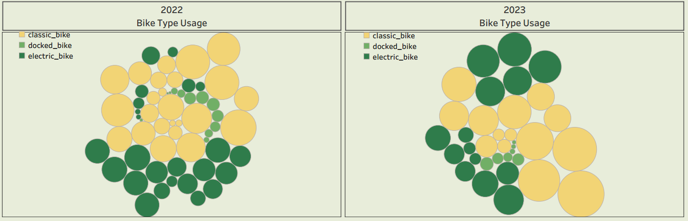
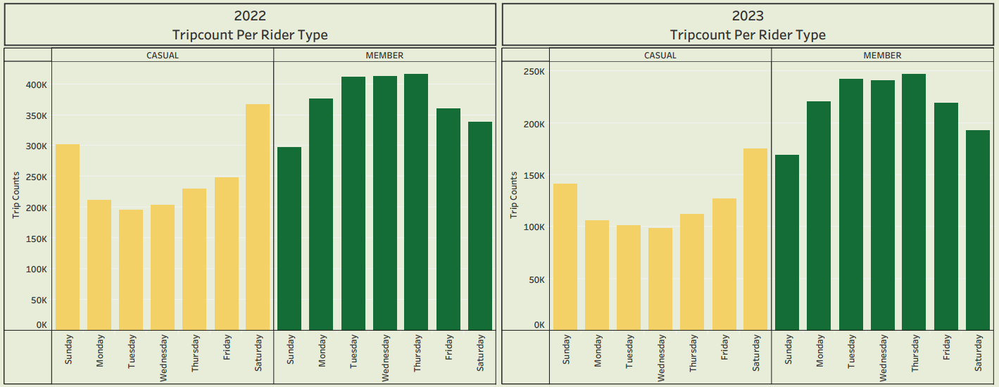
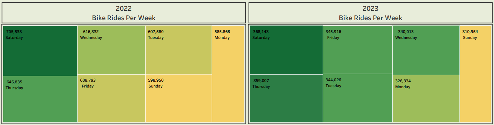

# Cyclistic_BikeShare

# Table of Contents
- [Introduction](*introduction)
- [Business Task](*business-task)
- [Data Source](*data-source)
- [Tools](*tools)
- [Methods](*methods)
- [Graphs](*graphs)
- [Summary of Findings](*summary-of-findings)
- [Key Observation](*key-observation)
- [Recommendations](*recommendations)
- [Limitations](*limitations)
- [Code](*code)
- [Dashboard](*dashboard)
# Introduction
Cyclistic is a fictional bike share company that launched a successful bike-share offering in 2016. The program however, has grown to a fleet of 5,824 bicycles that are geotracked and locked into a network of 692 stations across Chicago. Cyclistic customers comprise of two rider types namely; Casual Riders which are customers who purchase single-ride or full-day passes and Cyclistic Members which are customers who purchase annual membership.
# Business Task
Converting Casual Riders to Cyclistic Members
# Data Source
The data used was made available by a real bike share Company named Divvy.It includes tripdata originally stored in csv files and organized by different months of each year. [Link](https://divvy-tripdata.s3.amazonaws.com/index.html)
# Tools
- Excel
- R
- Tableau
# Methods
I decided to analyse the tripdata for year 2022 from January to December and year 2023 from January to July being the most recently updated tripdata, the analysis process are as follows:
- Loaded the files into Excel for cleaning
- Checked for inconsistent formats and corrected errors
- Created two extra columns for ride length and day of week
- Calculated the percentage and count of missing values
- Imported the file into RStudio for further cleaning and analysis
- Removed missing values and duplicate rows
- Filtered out dirty data irrelevant to the analysis
- Converted data types
- Carried out statistical calculations
- Plotted graphs for visualization
- Exported file in order to create better visualization in Tableau
# Graphs
The results at a glance:

# Summary of Findings
A comparison of the tripdata from the previous year and the present year shows the historical pattern  and consistency in rider preferences
- Both members and casual riders frequently used classic bikes compared to other bike types
- Docked bikes were only used by casual riders, while classic and electric bikes were used by both member and casual riders
- Members had the highest trip counts and the most frequent rides during the week
- Saturday was the day with the most frequent rides by both members and casual riders
# Key Observation
Casual riders that frequently use classic bikes have higher chances of being converted to annual members, therefore the advertising campaigns should be directed towards them
# Recommendations
1. Advertising campaigns should be strategized and geared towards improving the quality of classic bikes in order to attract the interest of more casual riders
2. Incentives such as discounts should be included for annual members, especially those using classic bikes
3. Free test rides with the remodified classic bikes should be introduced to the casual riders to arouse their interest
# Limitations
- Incomplete data with a lot of missing values limited the quality of the analysis
- Inability to access pass purchases made by riders due to privacy issues
# Code
You can explore the codes I wrote for the analysis [here](https://github.com/johyexson/Cyclistic_BikeShare/blob/main/My_Capstone_Project.R)
# Dashboard
The dashboard I created in Tableau can be viewed [here.](https://public.tableau.com/app/profile/joy.johnson5229/viz/Cyclistic_BikeShare_16944692451940/CyclisticBikeShareDashboard)
